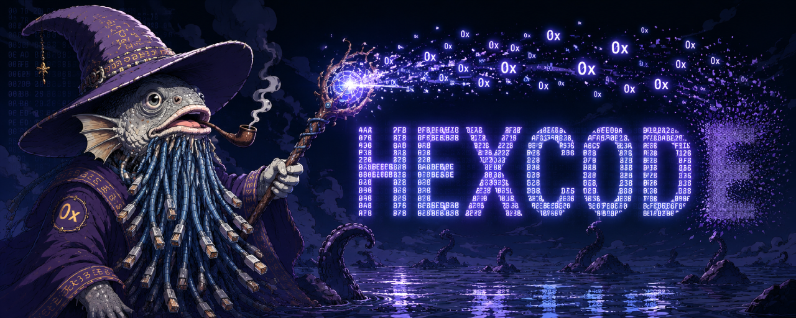

<p align="center">
    
</p>

Binary reader designed to simplify reading from unaligned offsets. Fast, easy to use, lightweight, and dependency-free.

## Table of Contents

- [Installation](#installation)
- [Basic usage](#basic-usage)
- [Data types](#data-types)
- [Strings](#strings)
- [Zero-copy reads](#zero-copy-reads)
- [API reference](#api-reference)

## Installation

This package is not published to any registry and must be installed manually.

### 1. Clone, build, and pack the source

```bash
# Clone the repository
git clone https://github.com/fizary/hexcod.git

# Go to the library root directory
cd hexcod

# Install dependencies
npm ci

# Build the source code
npm run build

# Pack the library into a tarball
# You can move created file to any location
npm pack
```

### 2. Install it in your project

```bash
# Go to your project root directory
cd ../your-project

# Install the package using the path to the tarball
npm i hexcod-1.0.0.tgz
```

## Basic usage

```typescript
import { BinaryStream } from "hexcod";

// Source we're gonna read data from
const source = new Uint8Array([
    0x48, 0x65, 0x6C, 0x6C, 0x6F, 0x20, 0x4A, 0x61, 0x76, 0x61, 0x53, 0x63, 0x72, 0x69, 0x70, 0x74, 0x00,
    0x05, 0x39,
    0x0B, 0xBF, 0xB7, 0x00,
    0x6C, 0xC5, 0x98, 0x00,
]);

// Create a BinaryStream instance
const stream = new BinaryStream(source);

// Read a null-terminated utf-8 string
console.log(stream.readTerminatedString());

// Read uint16 big-endian element
console.log(stream.read("u16be"));

// Read uint32 little-endian array
console.log(stream.read("u32le", 2));

// Output:
// Hello JavaScript
// 1337
// [12041995, 10012012]
```

## Data types

BinaryStream supports all binary data types available in JavaScript `TypedArray` and `DataView` APIs. Multi-byte data types in BinaryStream use explicit endianness suffixes: `le` for little-endian and `be` for big-endian.

| DataType | PrimitiveValue | TypedArray | Endianness |
|-|-|-|-|
| i8    | number | Int8Array      | -             |
| u8    | number | Uint8Array     | -             |
| i16le | number | Int16Array     | little-endian |
| i16be | number | Int16Array     | big-endian    |
| u16le | number | Uint16Array    | little-endian |
| u16be | number | Uint16Array    | big-endian    |
| f16le | number | Float16Array   | little-endian |
| f16be | number | Float16Array   | big-endian    |
| i32le | number | Int32Array     | little-endian |
| i32be | number | Int32Array     | big-endian    |
| u32le | number | Uint32Array    | little-endian |
| u32be | number | Uint32Array    | big-endian    |
| f32le | number | Float32Array   | little-endian |
| f32be | number | Float32Array   | big-endian    |
| i64le | bigint | BigInt64Array  | little-endian |
| i64be | bigint | BigInt64Array  | big-endian    |
| u64le | bigint | BigUint64Array | little-endian |
| u64be | bigint | BigUint64Array | big-endian    |
| f64le | number | Float64Array   | little-endian |
| f64be | number | Float64Array   | big-endian    |

> The `read` method returns either a single primitive value or a typed array, depending on whether the `length` argument is provided.

## Strings

BinaryStream uses standard `TextDecoder` API for string decoding. Each stream has a default text decoder stored in `textDecoder` property, which defaults to `new TextDecoder("utf-8")`. A custom text decoder can be provided via `textDecoder` stream option, or by calling `setTextDecoder` method. String reading methods use stream text decoder by default, but a different text decoder can also be provided directly to a method call.

```typescript
import { BinaryStream } from "hexcod";

const utf16leTextDecoder = new TextDecoder("utf-16le");
const utf16beTextDecoder = new TextDecoder("utf-16be");

// Set default text decoder via stream option
const stream = new BinaryStream(source, { textDecoder: utf16leTextDecoder });

// Or via dedicated method
stream.setTextDecoder(utf16leTextDecoder);

// String reading methods use stream text decoder by default
stream.readString(32);

// This can be overridden for a single call by passing additional arguments
stream.readString(32, utf16beTextDecoder);
```

BinaryStream uses encoding map to associate `TextDecoder.encoding` labels with corresponding terminator byte sequences. The library includes a [built-in encoding map](src/encodings.ts#L12-L52) covering all encodings supported by `TextDecoder`. A custom encoding map can be provided via `encodingMap` stream option, or by calling `setEncodingMap` method. String reading methods infer terminator byte sequences from encoding map by default, but a different terminator byte sequence can also be provided directly to a method call.

```typescript
import { BinaryStream, type EncodingMap } from "hexcod";

const fourByteTerminator = [0x00, 0x00, 0x00, 0x00];
const customEncodingMap: EncodingMap = { "utf-32le": fourByteTerminator };
const utf32leTextDecoder = new CustomTextDecoder("utf-32le");
const utf32beTextDecoder = new CustomTextDecoder("utf-32be");

// Set encoding map via stream option
const stream = new BinaryStream(source, { encodingMap: customEncodingMap });

// Or via dedicated method
stream.setEncodingMap(customEncodingMap);

// String reading methods infer terminator byte sequence from encoding map by default
stream.readTerminatedString(utf32leTextDecoder);

// This can be overridden for a single call by passing additional arguments
stream.readTerminatedString(utf32beTextDecoder, fourByteTerminator);
```

## Zero-copy reads

BinaryStream performs zero-copy reads when the requested data is properly aligned and the requested endianness matches the platform's native endianness. If these conditions are not met, the data is read through a copied buffer. This means that typed arrays read via zero-copy directly reference the stream's source buffer, while those read through a copied buffer reference it instead.

Single-byte elements such as `i8` or `u8`, as well as strings, are always read via zero-copy.

## API reference

This section documents the public API exposed by the library.

```typescript
/**
 * Indicates whether the current platform uses little-endian byte order natively.
 */
export const PLATFORM_LITTLE_ENDIAN: boolean;

/**
 * Mapping of encoding labels to terminator byte sequences.
 * Keys should match the `TextDecoder.encoding` property.
 */
export type EncodingMap = Record<string, number[] | undefined>;

/**
 * Supported binary data types.
 *
 * Multi-byte types include an explicit endianness suffix: `le` for little-endian and `be` for big-endian.
 */
export type DataType =
    | "i8"
    | "u8"
    | "i16le" | "i16be"
    | "u16le" | "u16be"
    | "f16le" | "f16be"
    | "i32le" | "i32be"
    | "u32le" | "u32be"
    | "f32le" | "f32be"
    | "i64le" | "i64be"
    | "u64le" | "u64be"
    | "f64le" | "f64be";

/**
 * Valid stream data source.
 */
export type StreamSource =
    | ArrayBuffer
    | ArrayBufferView<ArrayBuffer>;

/**
 * Configuration options for initializing or reinitializing a stream.
 */
export type StreamOptions = {
    /**
     * Byte offset, which combined with `byteLength` specifies the range covered by the stream.
     *
     * The resulting range must remain within the bounds of the source.
     *
     * Defaults to `source.byteOffset` when an ArrayBufferView is used, otherwise `0`.
     */
    byteOffset?: number;

    /**
     * Byte length, which combined with `byteOffset` specifies the range covered by the stream.
     *
     * The resulting range must remain within the bounds of the source.
     *
     * Defaults to `source.byteLength`.
     */
    byteLength?: number;

    /**
     * Mapping of encoding labels to terminator byte sequences, used when reading strings.
     *
     * Keys should match the `TextDecoder.encoding` property.
     * 
     * Defaults to a built-in map.
     */
    encodingMap?: EncodingMap;

    /**
     * Default text decoder used when reading strings.
     * 
     * Defaults to `new TextDecoder("utf-8")`.
     */
    textDecoder?: TextDecoder;
};

/**
 * Configuration options for creating a substream.
 */
export type SubstreamOptions = {
    /**
     * Mapping of encoding labels to terminator byte sequences, used when reading strings.
     */
    encodingMap?: EncodingMap;

    /**
     * Default text decoder used when reading strings.
     */
    textDecoder?: TextDecoder;
};

/**
 * Binary reader designed to simplify reading from unaligned offsets.
 */
export class BinaryStream {
    /**
     * Underlying buffer.
     */
    buffer: ArrayBuffer;

    /**
     * Uint8Array covering the accessible range.
     */
    view: Uint8Array<ArrayBuffer>;

    /**
     * DataView covering the accessible range.
     */
    dataview: DataView<ArrayBuffer>;

    /**
     * Cursor position relative to the start of the stream.
     */
    offset: number;

    /**
     * Mapping of encoding labels to terminator byte sequences, used when reading strings.
     */
    encodingMap: EncodingMap;

    /**
     * Default text decoder used when reading strings.
     */
    textDecoder: TextDecoder;

    /**
     * Cursor position relative to the start of the underlying buffer.
     */
    get bufferOffset(): number;

    /**
     * Length of the stream in bytes.
     */
    get byteLength(): number;

    /**
     * Number of bytes from the cursor position to the end of the stream.
     */
    get remaining(): number;

    /**
     * Creates a new stream over the given source.
     *
     * @param source Stream source.
     * @param options Optional configuration.
     * @throws {OutOfBoundsError} When requested range is outside source bounds.
     */
    constructor(source: StreamSource, options?: StreamOptions);

    /**
     * Reinitializes the stream with a new source and options.
     * 
     * @param source Stream source.
     * @param options Optional configuration.
     * @throws {OutOfBoundsError} When requested range is outside source bounds.
     */
    reInit(source: StreamSource, options?: StreamOptions): void;

    /**
     * Creates a substream over the next range of bytes.
     * 
     * Advances the parent cursor by `byteLength`.
     *
     * @param byteLength Number of bytes in the substream.
     * @param options Optional configuration. Inferred from parent stream when not provided.
     * @returns A new stream covering the requested range.
     * @throws {OutOfBoundsError} When requested range is outside parent stream bounds.
     */
    substream(byteLength: number, options?: SubstreamOptions): BinaryStream;

    /**
     * Sets the encoding map.
     * 
     * @param encodingMap Encoding map to use.
     */
    setEncodingMap(encodingMap: EncodingMap): void;

    /**
     * Sets the text decoder.
     * 
     * @param textDecoder Text decoder to use.
     */
    setTextDecoder(textDecoder: TextDecoder): void;

    /**
     * Moves the cursor to an absolute position.
     *
     * @param offset New cursor position.
     * @throws {OutOfBoundsError} When new cursor position is outside stream bounds.
     */
    seek(offset: number): void;

    /**
     * Moves the cursor relative to the current position.
     *
     * @param byteLength Number of bytes to move the cursor by. Negative values move the cursor backward.
     * @throws {OutOfBoundsError} When new cursor position is outside stream bounds.
     */
    seekBy(byteLength: number): void;

    /**
     * Reads a single element.
     * 
     * The cursor advances by the size of the requested element.
     *
     * @param type Data type of the element.
     * @returns The requested element.
     * @throws {UnknownDataTypeError} When `type` is not supported.
     * @throws {OutOfBoundsError} When read outside stream bounds.
     */
    read<T extends DataType>(type: T): PrimitiveValue<T>;

    /**
     * Reads an array of elements.
     *
     * Performs zero-copy when alignment and endianness allow it.
     * Otherwise data is copied.
     * 
     * The cursor advances by the size of the requested array.
     *
     * @param type Data type of the array.
     * @param length Length of the array.
     * @returns The requested array.
     * @throws {UnknownDataTypeError} When `type` is not supported.
     * @throws {OutOfBoundsError} When read outside stream bounds.
     */
    read<T extends DataType>(type: T, length: number): TypedArray<T>;

    /**
     * Reads a string terminated by a byte sequence.
     * 
     * The cursor advances past the terminator.
     * 
     * @param decoder Text decoder used for decoding. Defaults to stream `textDecoder`.
     * @param terminatorBytes Terminator byte sequence. Inferred from `encodingMap` when not provided.
     * Its length is treated as the code unit size.
     * @returns The decoded string.
     * @throws {UnknownEncodingError} When `terminatorBytes` cannot be resolved.
     * @throws {TerminatorNotFoundError} When no terminator is found in the remaining data.
     */
    readTerminatedString(decoder?: TextDecoder, terminatorBytes?: number[] | undefined): string;

    /**
     * Reads a fixed-length string.
     * 
     * Optionally trims repeated trailing terminator byte sequences.
     * Trimming is skipped when `terminatorBytes` is `false` or when `byteLength` is not aligned to the code unit size.
     * 
     * The cursor advances by `byteLength`.
     * 
     * @param byteLength Number of bytes to read.
     * @param decoder Text decoder used for decoding. Defaults to stream `textDecoder`.
     * @param terminatorBytes Terminator byte sequence. Inferred from `encodingMap` when not provided.
     * Its length is treated as the code unit size.  
     * Use `false` to disable trimming.
     * @returns The decoded string.
     * @throws {UnknownEncodingError} When `terminatorBytes` cannot be resolved.
     * @throws {OutOfBoundsError} When read outside stream bounds.
     */
    readString(byteLength: number, decoder?: TextDecoder, terminatorBytes?: number[] | false | undefined): string;
}
```
